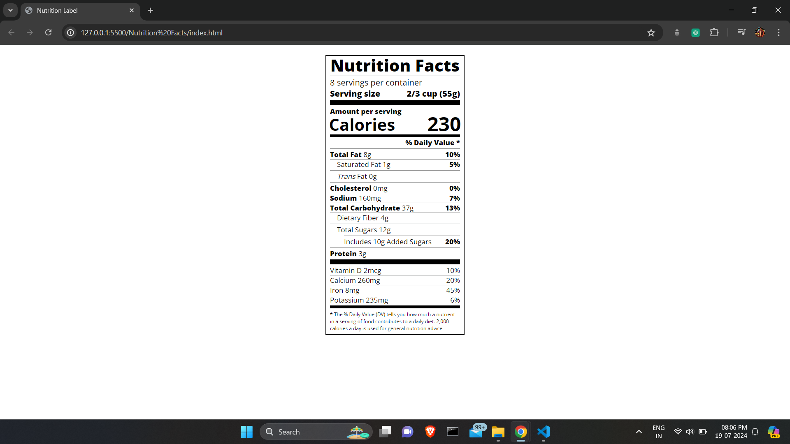

# Nutrition Label Project

This project showcases a nutrition label created with HTML and CSS. It includes serving size, calorie information, and daily values for various nutrients. The design mimics standard food packaging labels, using custom fonts and dividers for clarity. This project demonstrates effective web content structuring and styling skills.

## Live Demo

Check out the live demo [here]([URL_OF_YOUR_HOSTED_PROJECT](https://jaxesh.github.io/Nutrition-Facts/)).

## Screenshot

## Files Included

- `index.html`
- `styles.css`

## Commit Message

